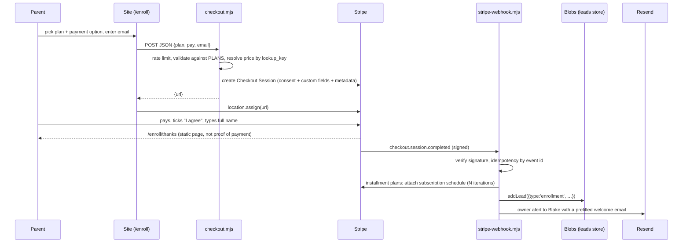

# Stripe integration plan

> **HOST CHANGED, 9 SEPTEMBER 2026.** This site no longer runs on Netlify. It is on Firebase
> Hosting, with one Cloud Function behind `/api/**`, Firestore in place of Netlify Blobs, and
> real endpoints in place of Netlify Forms. Wherever this file says Netlify, read
> [`FIREBASE.md`](FIREBASE.md) instead. Everything about prices, Stripe, content and the admin
> panel below is still accurate.


> **SEPTEMBER 2026 PRICE CHANGE.** The catalog block below has been rewritten to match, but
> `src/lib/plans.mjs` is the source of truth and this file is a design note, not a spec. Two
> things changed shape, not just value: a membership now carries a `totals` map keyed by pay
> option, because paying monthly costs more than paying up front; and `split` (two payments)
> is no longer sold, so `PAY_OPTIONS` is `full` and `monthly`. Session counts are gone from
> the catalog because the price sheet publishes none.

**Status, 8 September 2026:** Phases 1 and 2 are built, using the default of every decision
in the table at the end. Of Phase 3, CSV export and the enrollment link builder shipped; the
"Renew" action did not. Phase 0 and the live-mode tests wait on Blake. Nothing has called
Stripe yet.

Written 8 September 2026 against commit `d526cdb`. Same shape as `ADMIN-PANEL-PLAN.md`:
where we start, the design and why, then phases with file-level scope and a test for each.

---

## Where we start

**The business process is already fixed, and Stripe has to fit it, not replace it.**
Blake never quotes over text. The order is: intro call, evaluation ($50, or $35 within 48
hours of the call), enrollment call, then an enrollment email with a payment link, then a
welcome email the parent answers "YES" to. Links are sent by Blake, during or right after a
call. The website's step 4 ("Enroll Online") promises: read the agreement, pick pay in full
/ monthly, type your name to agree. That step had no backend when this was written.

**What the site already has that Stripe can reuse:**

| Need | Already here |
|---|---|
| Serverless endpoints | `netlify/functions/*.mjs`, Functions v2 (`Request`/`Response`), esbuild-bundled |
| Storage without a database | Netlify Blobs via `lib/leads.mjs` (`addLead`/`listLeads`), local JSON fallback |
| Abuse control | `lib/rate-limit.mjs` (`checkRateLimit`, `clientIp`), fails open by design |
| Transactional email | Resend call pattern in `playbook.mjs` (`RESEND_API_KEY`, `PLAYBOOK_FROM_EMAIL`) |
| Owner-facing records | Admin panel Leads tab (`leads-list.mjs`, `admin.js` `renderLeadsTable`) |
| Pricing source of truth | `OFFERS` in `src/lib/site-config.mjs`, `TRAINING_PAGES` in `build.mjs`, `programs.html`, `/terms` (all "must match" by convention) |
| Simple page builder | `buildSimplePage` in `src/render.mjs` (privacy, terms, contact, training pages) |
| Local dev with real functions | `scripts/dev-server.mjs` routes `/.netlify/functions/<name>`, passes raw body, sets `FB_LOCAL` |
| Terms the checkout must honour | `/terms` step 2: "type your full name … click the I agree box" |

**Constraints that shape the design:**

- `netlify.toml` CSP is `script-src 'self'`, `connect-src 'self'`, `form-action 'self'`
  (report-only), and `Permissions-Policy: payment=()`. The site ships zero third-party
  script and the critique loop measured that. Putting Stripe.js on the page is a real cost.
- Netlify free tier bills deploys in credits; nothing in the payment path may trigger a
  build. Payments must land in Blobs, not in git.
- The repo is public. No key, price ID, or account ID goes in it.
- The money goes to Blake. The Stripe account is his; the developer gets a restricted key.

---

## The design

### One decision drives everything: Stripe Checkout, hosted, redirect

Not Payment Elements, not embedded Checkout. Reasons, in order:

1. **No Stripe.js on the site.** CSP, Permissions-Policy, and the performance budget are
   untouched. Card data never touches a page we serve (PCI SAQ-A).
2. **Checkout can express the agreement natively.** `consent_collection.terms_of_service:
   'required'` renders the "I agree to the terms" box linked to `/terms`, and a
   `custom_fields` text field renders "Type your full name to agree to the terms". Stripe
   stores both on the session, which is Blake's evidence in a dispute. That is exactly what
   the signed agreement's Step 2 describes, with no form of our own.
3. **Subscriptions, receipts, failed-card retries, and card updates are dashboard
   features.** Smart Retries, receipt emails, dunning emails and the no-code Customer
   Portal login link cover the payment policy's "replace your card within 24 hours" without
   a line of code.

### Prices live in Stripe, keyed by the site's own catalog

Stripe Products/Prices are created once by a script from a catalog in the repo, each price
carrying a `lookup_key`. Functions resolve prices by lookup key at request time. No price
IDs in env vars, no amounts in client requests, and one file to change when a rate changes.

```
src/lib/plans.mjs                       the catalog, and one pure function
─────────────────────────────────────────────────────────────────────────
PLANS = {
  'eval':               { label:'Evaluation Session', cents: 5000, kind:'once' },
  'eval-call':          { …cents: 3500, kind:'once' },              // the 48-hour rate
  'group-3m-1x':        { months: 3, noticeDays:  7, totals:{ full:  45000, monthly: 55000 } },
  'group-3m-unlimited': { months: 3, noticeDays:  7, totals:{ full:  65000 } },
  'group-6m-1x':        { months: 6, noticeDays: 60, totals:{ full:  75000, monthly: 90000 } },
  'group-6m-unlimited': { months: 6, noticeDays: 60, totals:{ full: 100000 } },
}
PAY_OPTIONS = ['full', 'monthly']   // a plan offers exactly the ones it prices

checkoutSpec(planKey, pay) → {
  lookupKey,        // e.g. 'group-6m-1x-monthly'
  mode,             // 'payment' | 'subscription'
  amountCents,      // full: the term total; monthly: that total over months, rounded
  iterations,       // monthly: months, full: null
  endBehavior,      // 'release'   (see Decision 3)
  metadata: { plan, pay, months, noticeDays, totalCents }
}
```

That is eight lookup keys: four memberships, two of which price monthly as well as in
full, plus the two evaluation rates. The Unlimited tiers publish one figure each, so they
sell pay in full only rather than offering a monthly number nobody set. Private one on one
($3,000 per six month term) is **not** in the catalog on purpose: Blake schedules it by
hand and invoices it from the Stripe dashboard, which needs no code. Small group and
drop-in sessions were retired with the September 2026 sheet and have no successor.

### Flow



The **webhook is the source of truth**. The thanks page is copy only; it never reads
`session_id` to claim success.

### What gets recorded

One record per completed session, in the existing `leads` store so the admin panel's
Leads tab shows it beside contact and playbook leads with no new function:

```
{ type:'enrollment', timestamp, sessionId, customerId, subscriptionId|null,
  email, phone, name (the typed-to-agree field), playerName,
  plan, planLabel, pay, amountCents, amount, months, termTotalCents, noticeDays, startDate,
  cancelNoticeBy,            // startDate + months − noticeDays, the blank Blake fills by hand today
  paymentStatus, termsAccepted, livemode,
  notified }                 // true once the owner email went out; a resend retries it if not
```

### What the parent sees on Stripe

Business name FAST Basketball (dashboard branding, red `#E60C20`), product name from the
catalog label, which is where the parent reads the term ("Group Training Membership,
3 months, once a week"), phone collection on, the terms checkbox linking to
`https://fast-basketball.com/terms`, two custom fields (player's full name; type your
full name to agree). Stripe emails the receipt. `checkoutSpec().description` is written to
the price's `nickname`, which Stripe shows in the dashboard and never to the parent, so the
term total is disclosed on the `/enroll` card rather than on Checkout.

### What Blake sees

- Stripe dashboard: customers, subscriptions, consent and typed name on each session.
- An email per enrollment (Resend, same sender as the playbook) containing every detail
  plus the computed cancel-by date, written as the welcome email from the closing checklist
  so he pastes, adds the Zoom link, and sends. Deliberately not sent to the parent by us:
  Blake wants the "YES" reply in his own inbox, and Stripe already sent the receipt.
- Admin panel Leads tab: enrollments appear with plan and amount in the details column.

---

## Phases

### Phase 0: owner setup, no code, unblocks sales calls today

Blake does these (account creation and keys are his, per `LAUNCH.md`):

1. Create the Stripe account for FAST Basketball. Complete business profile and payouts.
2. Settings → Public details: business name, support phone `(503) 686-8371`, **Terms of
   service URL `https://fast-basketball.com/terms`** (required for the consent box),
   privacy URL `/privacy`.
3. Settings → Emails: turn on successful-payment receipts and failed-payment emails.
   Billing → Subscriptions: Smart Retries on, email customers when a payment fails and
   let them update the card.
4. Settings → Customer portal: enable the hosted **login link**. Put that link in the
   welcome email template. This is the "register a new card" path from the payment policy.
5. Developers → API keys: a **restricted key** for the site with write access to Checkout
   Sessions, Customers, Subscriptions, Subscription Schedules, Products and Prices. Write
   on the last two because the same key runs `scripts/stripe-catalog.mjs`, which creates
   products and prices and archives a replaced one. Give the key to the developer to enter in Netlify, or add the developer as a
   team member with the Developer role. Never the full secret key.
6. Optional but useful now: two dashboard **Payment Links** for the evaluation ($50 and
   $35). Blake can send those on calls before any site code exists. They are replaced by
   `/enroll?plan=eval` and `/enroll?plan=eval-call` in Phase 1.

### Phase 1: self-serve enrollment (one session)

**Goal: `/enroll` takes a parent from the plan matrix to a paid Stripe Checkout, in test
mode end to end, and the catalog script is idempotent.**

| File | Change |
|---|---|
| `package.json` | add `stripe` (the one new dependency; see "Dependencies" below) |
| `src/lib/plans.mjs` | catalog + `checkoutSpec()`; amounts must match `OFFERS`, `TRAINING_PAGES`, `programs.html`, `/terms` |
| `src/lib/plans.test.mjs` | `node --test`: every plan × pay produces a whole-cent price, a plan offers exactly the pay options it prices, monthly × months lands within a cent of the published total, monthly always costs more than paying in full, lookup keys unique |
| `scripts/stripe-catalog.mjs` | idempotent: for each spec, find price by `lookup_key`; create product/price if missing; on an amount change, create the new price with `transfer_lookup_key` and archive the old one. Run once per mode (test, then live) with `STRIPE_SECRET_KEY` in the shell, never committed |
| `netlify/functions/lib/stripe.mjs` | ~10 lines: client from `STRIPE_SECRET_KEY`, `priceByLookupKey()`, 503 helper when the key is unset |
| `netlify/functions/checkout.mjs` | POST JSON `{plan, pay, email, en-hp}` → honeypot, `checkRateLimit('checkout:'+ip, 10 per 10 min)`, validate `plan`/`pay` against `PLANS`, resolve price, create session with `consent_collection`, `custom_fields`, `customer_email`, `phone_number_collection`, `metadata`, `expires_at` 23h (an hour under Stripe's 24h ceiling), `success_url /enroll/thanks`, `cancel_url /enroll?plan=…` → `{url}`. Returns 503 `{error:'payments not configured'}` without a key, which the page turns into "Online enrollment opens soon, text Coach Blake" |
| `build.mjs` | `step11d_enrollPages`: `/enroll` (plan matrix rendered from `plans.mjs`, one form: plan radio group, payment option radio group, parent email, guardian checkbox like the contact form, honeypot) and `/enroll/thanks` (noindex, "check your email for the receipt; Coach Blake's welcome email arrives within 12 hours; reply YES"). `/enroll` in the sitemap, thanks page not |
| `src/js/enroll.js` | ~40 lines in the `contact-form.js` style: validate, `fetch` the function, `location.assign(url)`, inline error, disabled button while waiting. Reads `?plan=` to preselect |
| `src/templates/sections/enroll.html` | step 4 body links to `/enroll`; CTA row gains "Enroll Online" ghost button |
| `src/templates/sections/programs.html` | evaluation card: secondary link "Already had your call? Book the evaluation" → `/enroll?plan=eval`. Primary CTAs stay "Book Your Call": Blake does not want the call skipped |
| `netlify.toml` | `form-action` gains `https://checkout.stripe.com` so the no-JS POST fallback (function answers 303) is not reported; `/enroll/thanks` gets `X-Robots-Tag: noindex` and `Cache-Control: no-store`. `Permissions-Policy` unchanged: hosted Checkout runs on stripe.com |
| `README.md` | env table: `STRIPE_SECRET_KEY` (restricted), `STRIPE_WEBHOOK_SECRET` (Phase 2), `ENROLL_NOTIFY_EMAIL` (Phase 2, optional, defaults to `CONTACT.email`) |

Privacy page gets one paragraph: payments are processed by Stripe on Stripe's pages; the
site never sees card numbers; what Stripe keeps is governed by Stripe's privacy policy.

**Phase 1 test:** `node --test src/lib/plans.test.mjs` green. Then in test mode with
card `4242 4242 4242 4242`: each of the eight lookup keys checks out, the consent box and
typed-name field appear, `cancel_url` returns to the matrix with the plan preselected,
a request with a tampered `plan` gets 422, the 11th request in 10 minutes gets 429, and
JS disabled still reaches Stripe through the form POST. Lighthouse and the golden
baseline are unchanged on every page except the two new ones.

### Phase 2: record, notify, and stop installments (one session)

**Goal: every completed checkout produces exactly one record and one owner email, and a
monthly plan bills the term it was sold without anyone tracking the count by hand.**

| File | Change |
|---|---|
| `netlify/functions/stripe-webhook.mjs` | `await request.text()` raw body → `stripe.webhooks.constructEvent` with `STRIPE_WEBHOOK_SECRET` (400 on failure). Idempotency: keyed on the **Checkout Session id** in the existing leads store, not on the event id — a dashboard resend is a new event id for the same session, and event-id dedupe would write the enrollment twice. The record carries `notified`, so a resend after a failed owner email retries the email and a resend after a successful one returns `{duplicate:true}`. Anything that throws is answered 500 so Stripe retries. Handles: `checkout.session.completed` (expand `custom_fields`, `customer`, `subscription`; build the record; `addLead`; for `iterations` plans `subscriptionSchedules.create({from_subscription})` then `update({phases:[{items, iterations}], end_behavior})`; owner email), `invoice.payment_failed` (owner alert: who, amount, attempt count; parent already got Stripe's email), `customer.subscription.deleted` (owner alert). Everything else 200 and ignored |
| `netlify/functions/lib/notify.mjs` | move `sendEmail` out of `playbook.mjs` into a shared helper with a `to` and `subject`; playbook keeps working unchanged |
| `admin/admin.js` | `renderLeadsTable`: details column for `type === 'enrollment'` shows plan, pay option, amount; filter dropdown gains "Enrollment" |
| `LAUNCH.md` | Stripe section: Phase 0 checklist, `stripe listen` for local, live-mode cutover order (catalog script in live, live restricted key, live webhook endpoint + secret, one $0.50 real test refunded) |

Webhook endpoint registered in the Stripe dashboard as
`https://<site>/.netlify/functions/stripe-webhook` for the three event types. Locally:
`stripe listen --forward-to localhost:8899/.netlify/functions/stripe-webhook` and
`stripe trigger checkout.session.completed`; records land in `.local/leads.json`.

**Phase 2 test:** replay the same event twice, one record. `stripe trigger` for each
event type produces the right email to `ENROLL_NOTIFY_EMAIL`. Card `4000 0000 0000 0341`
attaches but fails the first invoice, and the failed-payment alert arrives. A monthly plan
shows a schedule of the term's iterations then `release` in the dashboard. The admin Leads tab lists the
enrollment with the correct cancel-by date. A request with a bad signature is a 400 and
writes nothing.

### Phase 3: polish, only if Blake asks (half a session)

- CSV export of enrollments alongside leads (the Phase 3 item already in `TIMELINE.md`).
- Per-family enrollment links from the admin panel. **Built, differently:** the panel copies
  an `/enroll?plan=…&pay=…&email=…` deep link rather than calling `checkout.mjs`, because a
  real Checkout Session URL expires in 23 hours and a link Blake pastes into an email must not.
- A "Renew" action for pay-in-full families when their term ends, once Decision 3 is settled.
  **Not built.**

### Not in this plan, and why

- **Auto-charging renewals for pay-in-full families.** The signed agreement says
  both "the next 12 months" and "$420". Until Blake resolves that (it is already in
  `docs/owner-open-items.md`), no code should charge a card for a renewal a parent has not
  seen in writing. Monthly families keep billing (Decision 3), which is the renewal the
  agreement describes for them.
- **Members-area gating** (the Expo app under `fast-basketball-app/` with Firebase). A
  later step could map Stripe customer email to a Firebase user on
  `checkout.session.completed`. Different repo, different session.
- **Sales tax.** `automatic_tax` off. Blake's accountant decides whether coaching in
  Florida is taxable; if yes it is one flag on the session.
- **Embedded checkout or Elements.** Would need `js.stripe.com` in `script-src`,
  `frame-src`, `connect-src`, and a `Permissions-Policy` change. Hosted Checkout makes all
  of it unnecessary.

---

## Decisions Blake owns before Phase 1 ships live

| # | Decision | Why it blocks | Default if he says "your call" |
|---|---|---|---|
| 1 | ~~**What "pay in full at a discount" means.**~~ **SETTLED 3 September 2026** by Blake's new price sheet, which publishes both figures for every tier: $450 in full or $550 monthly on 3 months, $750 or $900 on 6 months. Paying over time costs more, and the catalog says so directly instead of deriving it. | Set 6 of the 8 prices | n/a, answered |
| 2 | **Monthly prices that do not divide into whole cents.** $550 ÷ 3 is $183.333… and Stripe needs whole cents. | One price | Round to the nearest cent, which bills $183.33 × 3 = $549.99, a cent under the published total. Under is the right direction to miss. $900 ÷ 6 is exactly $150 |
| 3 | **What happens at the end of a monthly plan.** `release` keeps billing monthly until Blake cancels on written notice, which is the auto-renewal the parent expectations describe. `cancel` stops it and Blake sends a new link. | Schedule end behaviour | `release`. Pay-in-full terms simply end, since they are one payment |
| 4 | **Whether the $35 evaluation rate needs enforcing.** The site shows $50; the $35 link only goes out in the post-call email. Without a call there is no evaluation slot, so a found link buys nothing. | Whether to build a signed-link mechanism | Not enforced. Two prices, no token. Add a signed `?call=` link (HMAC with `ADMIN_SESSION_SECRET`, same as `lib/auth.mjs`) only if it is ever abused |
| 5 | **Stripe account ownership and the developer's access.** | Nothing can be built against the wrong account | Blake's account; developer gets a restricted key or a Developer-role seat |

Two items for the attorney review already listed in the open items, surfaced here because
Stripe makes them concrete: the agreement says "every 30 days" but Stripe bills monthly on
the anniversary day; and automatic renewal of consumer contracts carries disclosure rules in
Florida. Neither changes the code; both change wording on `/terms`.

---

## Dependencies

One new package: `stripe`. Considered doing it with `fetch` against the REST API and
`node:crypto` for signatures, which is about 40 lines. Rejected because webhook signature
verification and idempotent retries are the security and money-correctness core of the
whole thing, and the official SDK's `constructEvent` and idempotency-key handling are the
versions that are right on every edge. It is bundled by esbuild into the two functions
only; the built site and the build minutes are unaffected.

## Security notes

- Amounts never come from the client. The function accepts a plan key and resolves the
  price by lookup key server-side.
- The webhook trusts nothing without a valid signature, and is idempotent by Checkout
  Session id. A store failure answers 500 rather than 200, so Stripe redelivers instead of
  dropping a paid enrollment nothing recorded.
- The thanks page is not evidence of payment. The record is written by the webhook only.
- The checkout function is public and rate-limited like the playbook; a honeypot field
  matches the contact and playbook forms.
- No Stripe key, price ID, or webhook secret in the repo. Test keys and live keys are
  separate Netlify env values; switching mode is an env change plus rerunning the catalog
  script in live mode.
- Consent (`terms_of_service` acceptance) and the typed name live on the Stripe session,
  which is the evidence Blake needs in a dispute. The record also stores `termsAccepted`.

## Known limits, stated plainly

- **The editor cannot change what is charged.** Prices in `programs.html` are owner-editable
  text (`prog.*` hooks). Editing them changes the page, not Stripe. The catalog in
  `plans.mjs` plus `scripts/stripe-catalog.mjs` is the only path that changes a charge.
  `plans.test.mjs` cannot catch a mismatch with the page; the existing "must match"
  convention across `OFFERS`, `TRAINING_PAGES`, `programs.html` and `/terms` now has a
  fifth member.
- **The signed agreement still sells things the site no longer does.** It lists a split
  payment option, a 12 month term and a $420 renewal, none of which exist on the September
  2026 sheet. `/terms` reproduces the agreement verbatim and says above the rate card that
  it is being re-issued. Rewriting signed contract text to match new marketing is not the
  fix; re-issuing the document is, and that is Blake's.
- **No proration, no pausing.** The injury policy says payments continue; the site honours
  that by not building a pause.
- **Rate limiting fails open**, as everywhere else on the site. Stripe's own velocity
  controls are the second layer.
